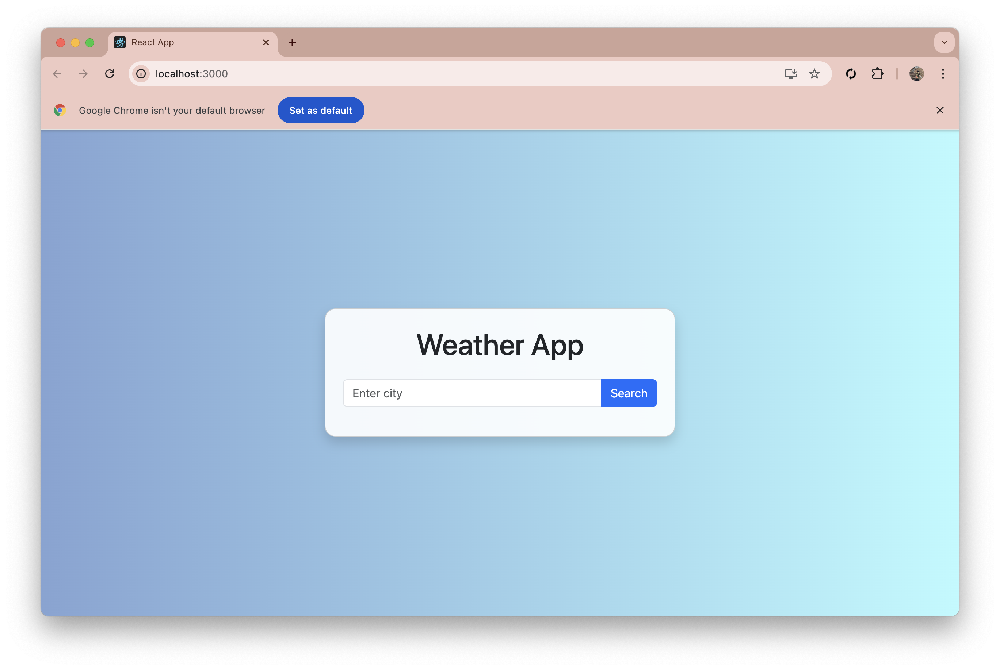
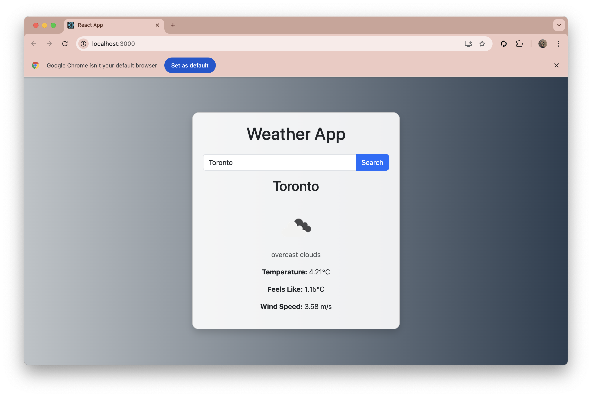
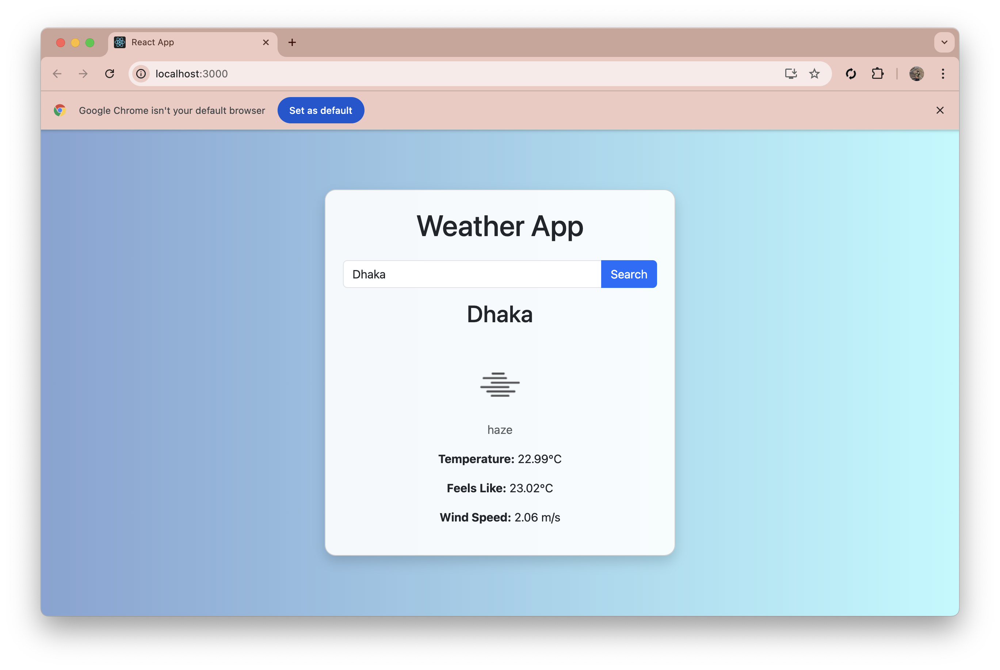
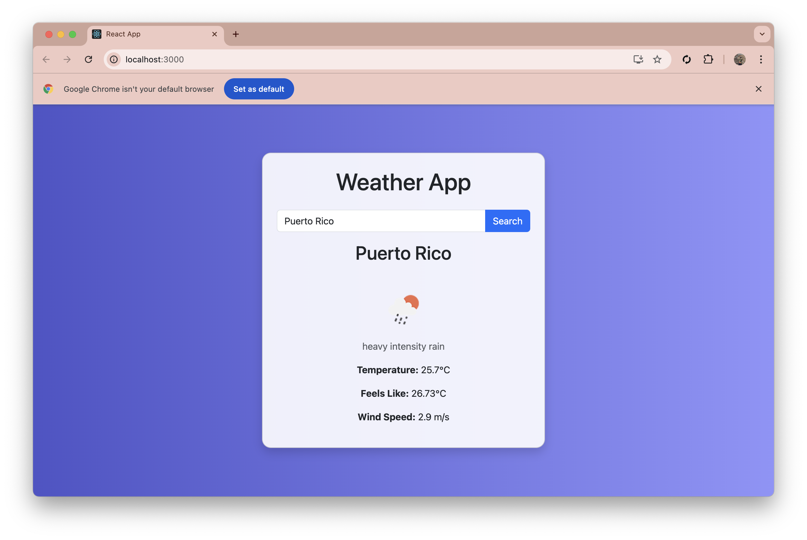
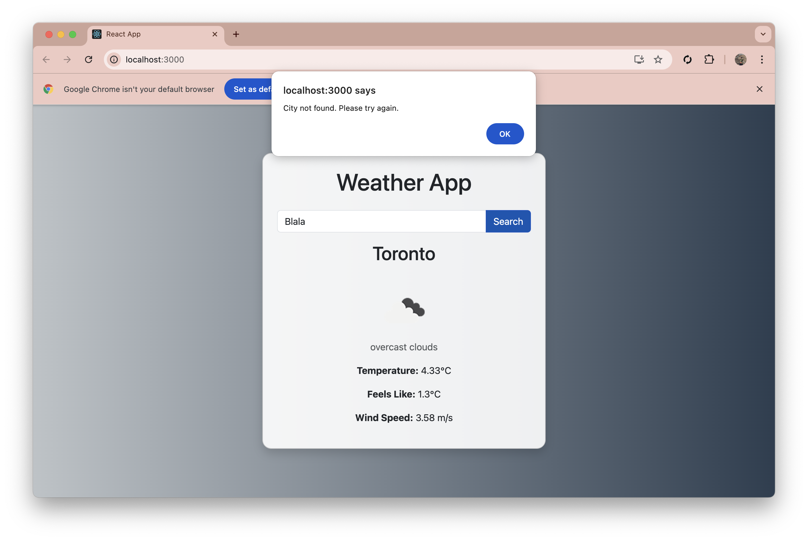

# Weather App 🌤️
A simple, user-friendly Weather App built with ReactJS that allows users to search for real-time weather conditions of any city. It uses the OpenWeatherMap API to fetch and display weather data dynamically.

---

## Features
- 🌍 Search weather by city
- 📊 Displays temperature, weather conditions, wind speed, and humidity
- 🎨 Dynamic background changes based on weather conditions (Clear, Rain, Clouds, etc.)
- 💻 Responsive design for various screen sizes
- 🖼️ Weather icons for better visualization


## Screenshots
### 1. Initial View


### 2. Search Weather and background chages depending on weather







### 4. City Not Found



####  API Details**
```markdown
## API Used
- [OpenWeatherMap API](https://openweathermap.org/api)
  - Endpoint: `http://api.openweathermap.org/data/2.5/weather`
  - Query Parameters:
    - `q`: City name
    - `appid`: Your API key
    - `units`: Metric (for Celsius temperatures)


#### Technologies Used**
```markdown
## Technologies Used
- **ReactJS**: Frontend library
- **Axios**: API integration
- **Bootstrap**: Styling
- **JavaScript**: Core logic
- **OpenWeatherMap API**: Weather data